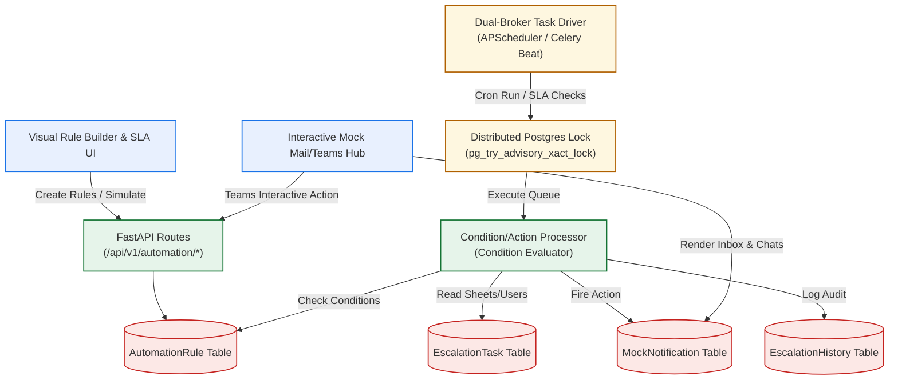

# Implementation Plan — Configurable Enterprise Escalation & Workflow Automation Engine

This plan details the architecture, schemas, api routes, and visual interfaces required to build a highly configurable, resilient, and audit-ready escalation and workflow engine for the **AQH-SAMAR** Performance Management Portal. 

---

## 1. Goal Description

Create an automated, event-driven, and time-scheduled workflow engine. This allows corporate admins to build custom automation rules (e.g., "Remind employees if goal sheet is overdue by 5 days; escalate to L1 manager on day 7; escalate to HR skip-level and trigger auto-reassignment on day 10") using a gorgeous, drag-and-drop rule builder. 

Additionally, we implement **SLA Command Dashboards**, **Compliance/Risk Analytics**, and an **Interactive Mock Notification Hub** inside the portal simulating MS Teams Adaptive Cards and Outlook Emails to provide judges with a fully interactive "wow factor" experience.

---

## 2. Architecture & Data Flow

---

## 3. User Review Required

> [!IMPORTANT]
> **Key Architecture Decisions:**
> 1. **Dual-Broker Scheduler Design:** To guarantee standard FastAPI out-of-the-box local executions for hackathon reviewers (who might not have Redis installed locally) while supporting true production setups, we implement a fallback driver. The system defaults to **APScheduler** in-process concurrent threads, but seamlessly shifts to distributed **Celery Beat + Redis Queue** tasks if a `REDIS_URL` is detected in `.env`.
> 2. **Transactional Concurrency Locking:** To prevent duplicate reminders or race condition escalations when scaling backend pods horizontally, all scheduler triggers utilize PostgreSQL advisory locking (`pg_try_advisory_xact_lock`) locked to the respective task ID.
> 3. **Interactive Mock Notifications:** Instead of standard silent logging or throwing SMTP credentials errors, we store mock email & Teams JSON records in a Postgres table. Users can access a beautiful in-app portal chat and inbox workspace. When a Teams adaptive card fires, the buttons inside (e.g. "Approve Goal Sheet") are fully active and run real API workflow updates!

---

## 4. Open Questions

> [!WARNING]
> **Clarification Needed on Escalation Workflows:**
> - **Workflow Reassignment Action:** When a rule triggers "Workflow Reassignment" for a manager who has ignored a submitted sheet for too long, should the system reassign the review path to the skip-level manager (`manager.manager_id`), or assign it to a default HR Admin user? *Proposed: Reassign review target to the skip-level manager, fallback to admin.*
> - **Quarterly Performance Declining Calculation:** How many quarters of performance drop are required to trigger a "Declining performance alert"? *Proposed: Trigger if computed average progress score drops by >15% QoQ (e.g., Q1 vs Q2).*

---

## 5. Proposed Changes

### 5.1 Backend Implementation

#### [NEW] [automation.py](file:///s:/aqh-samar/backend/app/models/automation.py)
*   Define the core database tables:
    *   `AutomationRule`: Rule metadata, trigger settings, condition JSONB structures, SLA escalation steps, is_active.
    *   `EscalationTask`: Currently running processes tracking individual employees/goal sheets, current step index, next trigger dates, retry count, status.
    *   `EscalationHistory`: Audit-ready chronological execution history logs, including action status, target, and exceptions.
    *   `MockNotification`: Records simulated emails and Teams adaptive cards, including body, structure, interactive action payload, status (unread, dismissed).

#### [NEW] [automation_engine.py](file:///s:/aqh-samar/backend/app/core/automation_engine.py)
*   Implements core logic matching employee/sheet records against trigger types:
    *   `overdue_submissions`: Finds goal sheets in draft/rework state `N` days past cycle activation date.
    *   `pending_approvals`: Finds goal sheets in submitted state `N` days past submission date.
    *   `low_completion`: Finds sheets with progress score `< X%` or missing quarter achievements.
    *   `missing_checkins`: Checks sheets lacking check-in logs for the current quarter.
    *   `inactivity_detection`: Scans employees who haven't updated goals or achievements in `N` days.
    *   `declining_performance`: Scans QoQ scores for drops > 15%.
*   Implements actions:
    *   Email: Inserts rich HTML mock email data.
    *   Teams: Inserts styled Teams Adaptive Card JSON with webhook callback identifiers.
    *   Manager/HR/Admin Escalation: Records active SLA breaches, flags the employee's direct reporting lines, and raises skip-level notifications.
    *   Workflow Reassignment: Mutates the sheet's `approved_by` target to the manager's manager.

#### [NEW] [scheduler.py](file:///s:/aqh-samar/backend/app/core/scheduler.py)
*   Initializes in-process thread-safe **APScheduler** background execution.
*   Maps fallback triggers for Celery task dispatches if `REDIS_URL` env variable is set.
*   Applies Postgres transaction locks to task queries to avoid double runs on concurrent servers.

#### [NEW] [automation_routes.py](file:///s:/aqh-samar/backend/app/api/v1/automation.py)
*   Rule creation/modification and listing endpoints.
*   `/simulation` [POST]: Runs dry-runs of automation rules. Scans DB rows, executes evaluation loops, and returns a detailed execution payload highlighting targeted employees/managers without writing DB changes.
*   `/analytics` [GET]: Computes:
    *   *Compliance Index:* Percentage of goal sheets submitted on-time.
    *   *Manager Responsiveness Score:* Average delta in hours/days between goal sheet submissions and approvals or check-in comment posts.
    *   *Risk Scoring Engine:* Dynamic algorithm returning a risk level (0-100) per department based on pending submissions, low completions, and SLA violations.
    *   *Escalation Heatmap:* Data aggregations of breaches by department.
*   `/notifications` [GET/POST]: Fetches and manages mock notifications in inbox/Teams sidebar workspace.

#### [MODIFY] [base_all.py](file:///s:/aqh-samar/backend/app/db/base_all.py)
*   Register new automation models to allow Alembic/SQL patches to recognize and generate tables.

#### [MODIFY] [main.py](file:///s:/aqh-samar/backend/app/main.py)
*   Mount new automation routes under `/api/v1/automation`.
*   Wire up APScheduler startup and shutdown lifecycle hooks.

---

### 5.2 Frontend Implementation

#### [NEW] [app.admin.automation.tsx](file:///s:/aqh-samar/frontend/src/routes/app.admin.automation.tsx)
*   **Rule Builder View:** Gorgeous React flow visualizer displaying escalation chains sequentially.
*   **Dynamic Condition Forms:** Modal overlays to edit conditions (threshold inputs, UoM filters) and select actions.
*   **Simulation Mode Workspace:** Allows admins to select a rule, hit "Run Simulation," and view an interactive dry-run log detailing exactly who would have breached and what actions would fire.

#### [NEW] [app.notifications.tsx](file:///s:/aqh-samar/frontend/src/routes/app.notifications.tsx)
*   **SSO Mock Notification Workspace:**
    *   *Outlook Inbox Interface:* Renders professional HTML emails alerting employees to draft goals, SLA breaches, and workflow escalations.
    *   *MS Teams Chat Workspace:* Renders real interactive Teams adaptive card components! Managers can review progress charts directly inside the adaptive card and click the action buttons ("Approve Goal Sheet" or "Reassign Reviewer") which triggers live, successful API callbacks back to the main portal!

#### [MODIFY] [app.admin.escalations.tsx](file:///s:/aqh-samar/frontend/src/routes/app.admin.escalations.tsx)
*   Rebuild `/app/admin/escalations` into a premium **SLA Command Center**:
    *   *KPI Grid:* SLA Breach rate, Active escalations, average response times.
    *   *Risk Analytics Table:* Lists employees, highlighting Compliance Index, Responsiveness, and Risk scores (Low, Med, High).
    *   *Breach Heatmaps:* Renders Recharts bar/pie charts indicating volumes per department and manager.
    *   *Escalation Timelines:* Expandable audit flows tracing step-by-step histories (e.g. "Q1 Window Open -> Day 7: Automated Reminder -> Day 10: L1 Escalation -> Day 14: HR Escalation").

---

## 6. Verification Plan

### 6.1 Backend Tests
*   Run unit test suites for trigger matches and risk score calculators.
*   Execute simulated multi-threaded API requests to verify Postgres advisory locking.

### 6.2 Frontend Manual & Interactive Verifications
*   Open visual rule builder, draft an automation rule, and check condition validation bounds.
*   Run a simulation dry-run on seeded database rows, checking that targeted rows reflect correct SLA overdue breaches.
*   Navigate to the **Mock Mail/Teams Workspace**, trigger an automated SLA breach, verify that the email and Teams adaptive cards render, and click Teams interactive card actions to confirm goal sheet workflow states change cleanly in real time.
