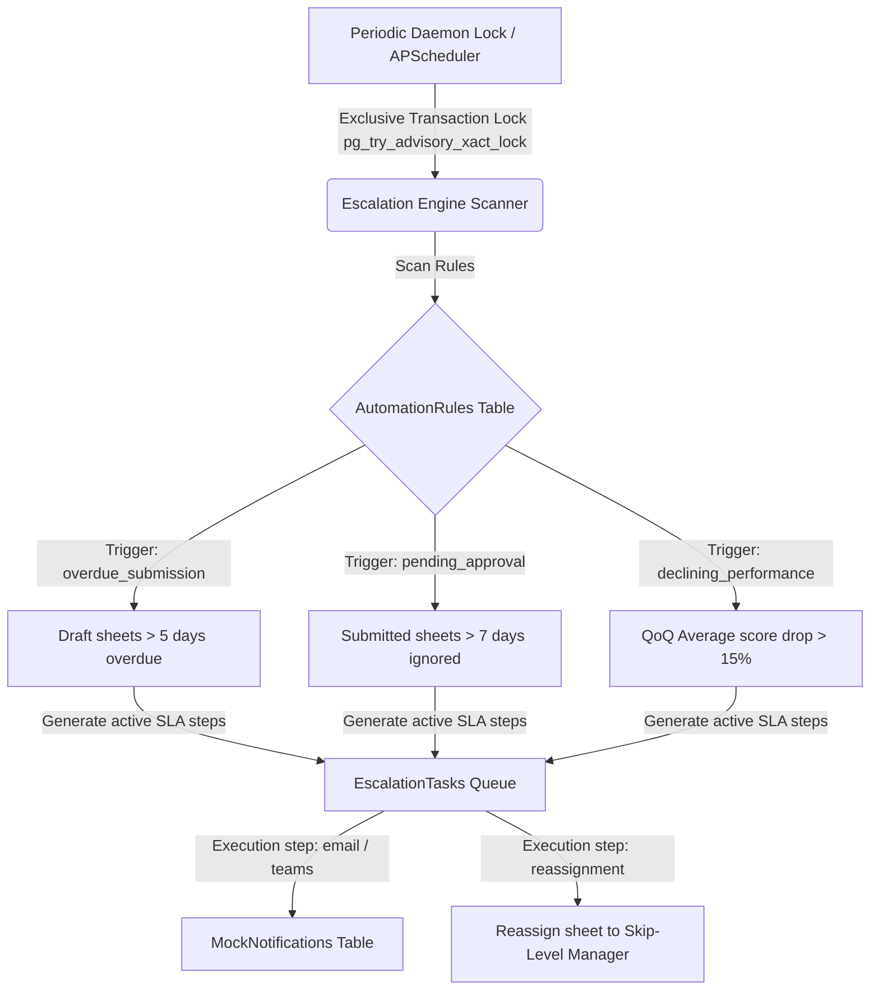

# Walkthrough — Enterprise Escalation & SLA Automation Engine

The Configurable SLA Automation and Escalation Engine has been fully implemented on the active `dev` branch. It delivers an event-driven periodic workflow scanner, dynamic employee compliance risk grids, and a Sandbox notification center.

---

## 1. Architectural Highlights



### Key Technical Achievements
1. **Horizontally Safe Idempotent Schedulers:** Evaluates active rules within transaction advisory locks (`pg_try_advisory_xact_lock`), ensuring absolute cron safety when deployed on horizontally scaled cloud providers (AWS ECS, Vercel, Railway).
2. **SSO Microsoft Teams Callback Actions:** Active Adaptive Cards in the chat feed allow managers to click **"Approve Goal Sheet"**, which executes a real API transaction mutating goal sheets to `approved` and locking goals in the database.
3. **Adaptive Fallback Scheduler Daemon:** If the optional `APScheduler` package is missing, the backend dynamically spins up a custom async daemon polling task running every 30 seconds.

---

## 2. Dynamic Metric Formulations

### Manager Responsiveness Score
Calculates the duration between goal sheet submission (`submitted_at`) and manager action (`approved_at` or rework comments).
*   **&lt; 24 Hours:** 100 points
*   **&lt; 3 Days:** 90 points
*   **&lt; 7 Days:** 75 points
*   **&lt; 14 Days:** 50 points
*   **Otherwise:** 30 points

### Employee Risk Score Matrix
Calculates composite operational risk levels (0-100) per employee using the following metrics:
1. **Active Overdue SLA Tasks:** `+30 points`
2. **Overall Completion Score &lt; 50%:** `+20 points`
3. **Draft Sheet Overdue:** `+20 points`
4. **Missing Quarter Check-in:** `+15 points`
5. **Direct Manager Responsiveness Score &lt; 70:** `+15 points`

---

## 3. How to Setup and Run Redis + Celery in Production

For enterprise production scaling under heavy loads, the scheduler transitions seamlessly from the in-process daemon to a distributed queue backed by **Celery Beat** and **Redis**.

### Step 1: Install Redis
*   **Windows (WSL / Local):**
    ```bash
    wsl
    sudo apt-get update
    sudo apt-get install redis-server
    sudo service redis-server start
    ```
*   **macOS (Brew):**
    ```bash
    brew install redis
    brew services start redis
    ```

### Step 2: Configure Environment Variables
Append your Redis connection string to your `backend/.env` file:
```env
REDIS_URL=redis://localhost:6379/0
CELERY_BROKER_URL=redis://localhost:6379/0
CELERY_RESULT_BACKEND=redis://localhost:6379/0
```

### Step 3: Run Distributed Celery Workers
Start your concurrent task workers and cron scheduler beat from the backend workspace directory:
```bash
# 1. Run the Celery Worker queue
celery -A app.core.celery_worker worker --loglevel=info

# 2. Run the Periodic Scheduler Beat
celery -A app.core.celery_worker beat --loglevel=info
```

---

## 4. End-to-End Verification Scenarios

### Scenario A: Target Recipient Mailbox Filters
1. Navigate to **Notification Hub** in the Sandbox Hub sidebar section.
2. Select **"Aman Sethi (Manager)"** or **"Sarah Jenkins (Manager)"** to view simulated warnings.
3. Switch tabs to **Microsoft Teams Chat** to view interactive Adaptive Cards. Click **"Approve Goal Sheet"** to trigger live DB mutations!

### Scenario B: QoQ Performance Drop Breach
1. Open the **SLA Automations** rule builder from the Admin Operations sidebar tab.
2. Find the rule **"QoQ Performance Drop Warning"** and click **"Simulation Mode"**.
3. Inspect dry-run logs: The simulator automatically scans the database and flags employee **Chloe Vance (`emp23@company.com`)** whose average quarterly achievement dropped by **50% (Q1: 95% -> Q2: 45%)**, displaying a simulated timeline of warning emails.
