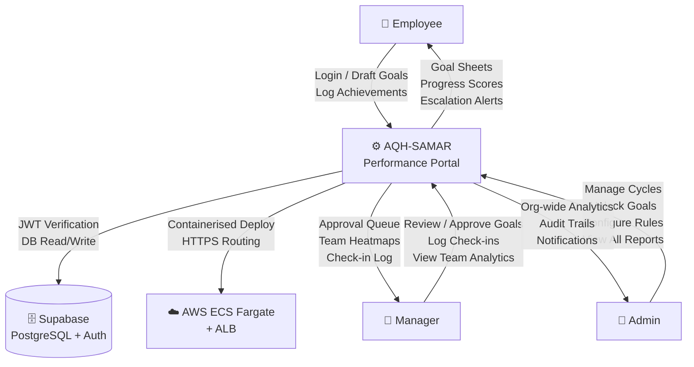
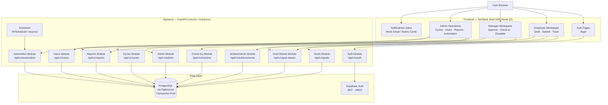
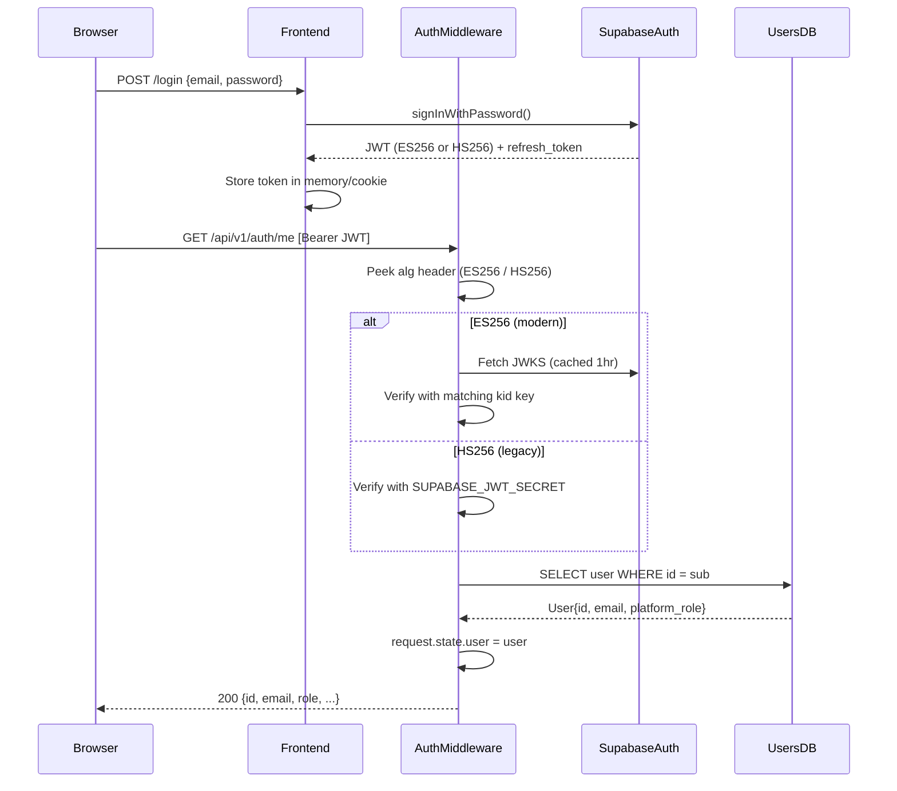
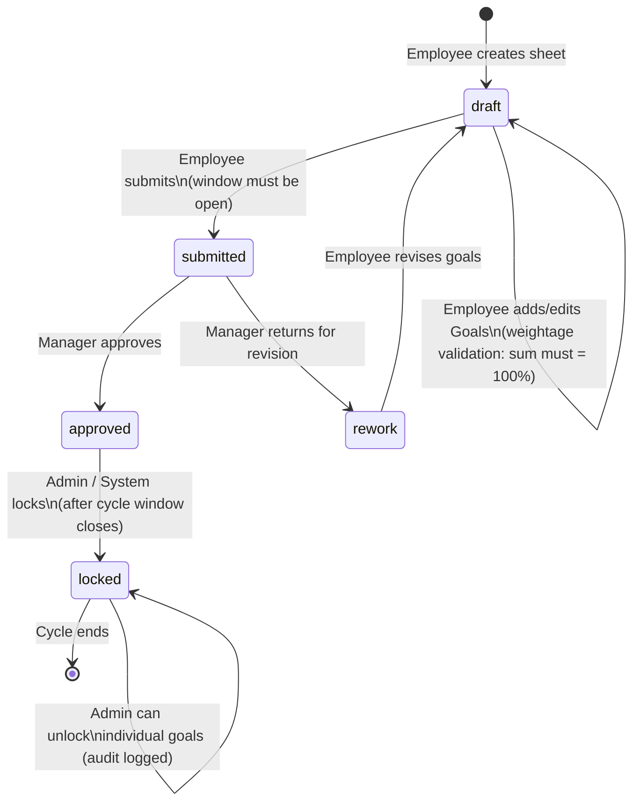
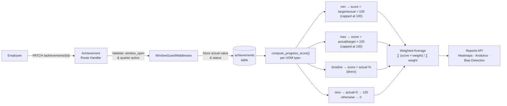
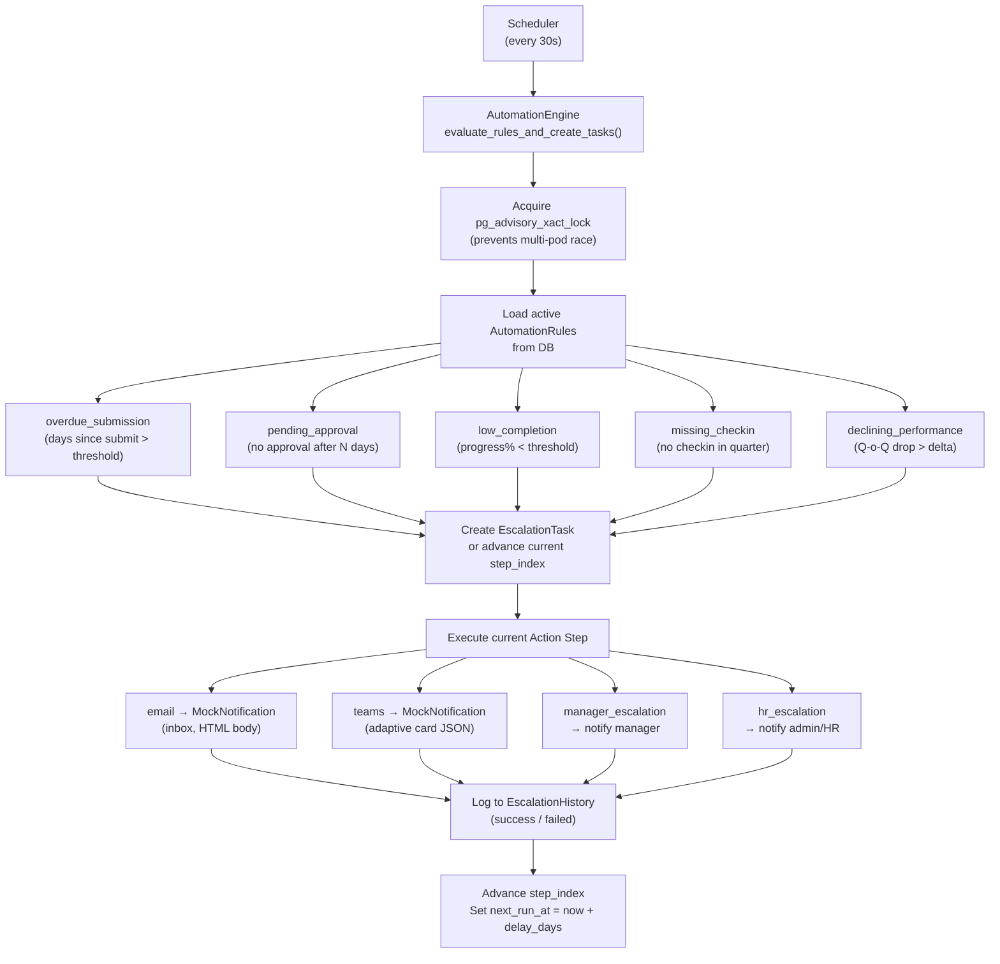
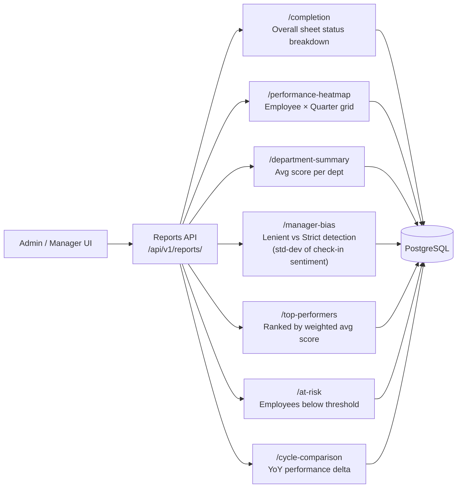

# AQH-SAMAR — Hackathon Submission Deliverables

> **System:** AQH-SAMAR Performance Management Portal  
> **Stack:** FastAPI + React (TanStack Start) + Supabase + AWS ECS Fargate  
> **Submitted by:** F16Samuel / SamarVermaCasamed

---

## Deliverable 1 — Live Hosted Demo URL

| Resource | URL |
|---|---|
| **Portal (Frontend)** | `https://aq-1aa8fca0a10f495da9fb8da1ae96cefc.ecs.ap-south-1.on.aws/app` |
| **Login Page** | `https://aq-1aa8fca0a10f495da9fb8da1ae96cefc.ecs.ap-south-1.on.aws/login` |
| **API Base** | `https://aq-1aa8fca0a10f495da9fb8da1ae96cefc.ecs.ap-south-1.on.aws/api/v1` |
| **Interactive Swagger Docs** | `https://aq-1aa8fca0a10f495da9fb8da1ae96cefc.ecs.ap-south-1.on.aws/docs` |

**Infrastructure:** AWS ECS Fargate (ap-south-1) behind an Application Load Balancer.  
Both the SSR React frontend (Port 3000) and the FastAPI backend (Port 80) run as independent Fargate services and are routed by a single ALB using path-pattern listener rules.

---

## Deliverable 2 — Source Code Repository

**GitHub:** `https://github.com/F16Samuel/aqh-samar`

### Repository Layout

```
aqh-samar/
├── backend/                   # FastAPI + SQLAlchemy + Alembic
│   ├── app/
│   │   ├── api/v1/            # Route handlers per domain
│   │   │   ├── auth.py        # JWT / Supabase auth
│   │   │   ├── users.py       # User CRUD + hierarchy
│   │   │   ├── cycles.py      # Performance cycle management
│   │   │   ├── goal_sheets.py # GoalSheet lifecycle
│   │   │   ├── goals.py       # Goal CRUD + sharing
│   │   │   ├── achievements.py# Quarterly KPI tracking
│   │   │   ├── checkins.py    # Manager check-ins
│   │   │   ├── reports.py     # Analytics + heatmaps
│   │   │   ├── admin.py       # Admin overrides + audit
│   │   │   └── automation.py  # Rules engine + escalations
│   │   ├── core/
│   │   │   ├── middleware.py  # JWT auth + window guard
│   │   │   ├── scheduler.py   # APScheduler / asyncio worker
│   │   │   ├── automation_engine.py # Rule evaluation core
│   │   │   └── config.py      # Settings / env management
│   │   ├── models/            # SQLAlchemy ORM models
│   │   ├── schemas/           # Pydantic request/response schemas
│   │   └── db/session.py      # Async engine + PgBouncer config
│   └── scripts/wipe_and_seed.py  # Full DB reseed with edge cases
├── frontend/                  # TanStack Start (React SSR)
│   └── src/routes/
│       ├── app.tsx            # Root layout + navigation
│       ├── app.achievements.tsx
│       ├── app.admin.automation.tsx
│       ├── app.admin.escalations.tsx
│       ├── app.notifications.tsx
│       └── ...
├── .github/workflows/deploy.yml  # CI/CD: test → build → ECS deploy
└── docs/                      # Audit reports + schema exports
```

**CI/CD Pipeline** (`.github/workflows/deploy.yml`):
1. **Test & Lint Backend** — `flake8` syntax/undefined-name checks (Python 3.11)
2. **Build & Deploy Backend** — Docker → ECR → ECS `force-new-deployment`
3. **Build & Deploy Frontend** — Docker (Node 22) → ECR → ECS `force-new-deployment`

---

## Deliverable 3 — Architecture Diagrams (DFD Style)

### Level 0 — Context Diagram



---

### Level 1 — System Decomposition (Major Modules)



---

### Level 2 — Module-Level DFDs

#### 2a. Authentication & Authorization Flow



#### 2b. Goal Sheet Lifecycle (Employee → Manager → Admin)



#### 2c. Achievements & Progress Scoring



#### 2d. Automation & Escalation Engine



#### 2e. Reporting & Analytics



---

## Deliverable 4 — Login Credentials & Edge Case Scenarios

**Universal Password for all seeded users: `password123`**

### Role Credentials

| Role | Email | Name | Department | Key Trait |
|---|---|---|---|---|
| **Admin** | `admin@company.com` | Neha Kapoor | Human Resources | Head of People Ops |
| **Manager** | `mgr1@company.com` | Aman Sethi | Engineering | Strict |
| **Manager** | `mgr2@company.com` | Elena Rostova | Product | Lenient |
| **Manager** | `mgr3@company.com` | Sarah Jenkins | Customer Success | Detail-oriented |
| **Manager** | `mgr4@company.com` | Marcus Aurelius | Security | Disengaged |
| **Employee** | `emp1@company.com` | Rhea Mukherjee | Engineering | Stellar performer |
| **Employee** | `emp2@company.com` | Tariq Mahmood | Engineering | Outlier (150% achievement) |
| **Employee** | `emp8@company.com` | Yasmine Belkacem | Product | Admin-unlocked goal |
| **Employee** | `emp13@company.com` | Hannah Abbott | Customer Success | Active escalation |
| **Employee** | `emp14@company.com` | Pedro Gomez | Customer Support | Underweight draft |
| **Employee** | `emp16@company.com` | James Sterling | Finance | Stalled pending approval |
| **Employee** | `emp17@company.com` | Alana Vance | Security | Overweight draft |
| **Employee** | `emp18@company.com` | Kojo Mensah | Security | Rework loop |
| **Employee** | `emp22@company.com` | Alice Walker | Finance | Cross-dept shared goal |
| **Employee** | `emp23@company.com` | Chloe Vance | Customer Success | Inconsistent (95%→45%) |
| **Employee** | `emp24@company.com` | Robert Frost | Customer Support | Chronic underperformer |
| **Employee** | `emp27@company.com` | Sarah Connor | Human Resources | Late joiner (admin-created sheet) |
| **Employee** | `emp5@company.com` | Jia-Hao Lin | Engineering | **Resigned** (is_active=False) |

---

### All Edge Cases & Cycles

| # | Scenario | Who | Status | What to verify |
|---|---|---|---|---|
| **A** | **Stellar Performer** | `emp1` (mgr: Aman Sethi) | `locked` | Q1 latency at 340ms (on_track), Q2 at 280ms (completed). One Sev-1 incident. Strict manager check-ins with critical commentary. |
| **B** | **Outlier 150% Achievement** | `emp2` (mgr: Aman Sethi) | `locked` | Goal target = 10 backups, actual = 15 (150%). System caps score at 100. Over-achievement visible in reports. |
| **C** | **Active Escalation — Long Pending** | `emp13` (mgr: Sarah Jenkins) | `submitted` | Submitted 16+ days ago with no approval. Automation engine should have created an escalation task and notified manager. Check notifications inbox. |
| **D** | **Underweight Draft** | `emp14` (mgr: Sarah Jenkins) | `draft` | Only 1 goal with weightage=30. Business rule blocks submission until total = 100%. Frontend shows validation error on submit. |
| **E** | **Overweight Draft** | `emp17` (mgr: Marcus Aurelius) | `draft` | 2 goals totaling 120% weightage. Business rule blocks submission. Frontend shows "total weightage exceeds 100%" error. |
| **F** | **Stalled Approval** | `emp16` (mgr: Sarah Jenkins) | `submitted` | Submitted 6 days ago. Approaching escalation SLA. Automation creates pending_approval task at threshold. |
| **G** | **Rework Loop** | `emp18` (mgr: Marcus Aurelius) | `rework` | Manager returned sheet. Employee must revise goal (target changed from 120→90 days per check-in comment). Re-submit flow. |
| **H** | **Admin Goal Unlock Override** | `emp8` (mgr: Elena Rostova) | `approved` | Sheet is `approved` but admin unlocked one goal (SOC2 Compliance, is_locked=False). Audit log shows the override. Admin can update that goal while others remain locked. |
| **I** | **Cross-Dept Shared Goals** | `emp22`, `emp3` (shared from admin) | `approved` | Admin pushed "Reduce sales cycle from 45→32 days" to both Finance and Security employees. Goal has `shared_from` foreign key. Achievement on child mirrors parent. |
| **J** | **Chronic Underperformer** | `emp24` (mgr: Sarah Jenkins) | `approved` | Q1: 25/100, Q2: 15/100 (scores 25% and 15%). Triggers `low_completion` automation rule. Escalation task created. Check-in comment demands turnaround plan. |
| **K** | **Inconsistent Performer (Q-o-Q Decline)** | `emp23` (mgr: Sarah Jenkins) | `approved` | Q1 NPS at 95% (excellent), Q2 at 45% (at_risk). Triggers `declining_performance` automation rule. Visible in cycle-comparison report. |
| **L** | **Late Joiner — Admin-Created Sheet** | `emp27` (mgr: Neha Kapoor) | `approved` | Sheet created and approved by Admin directly (bypassing normal submit flow). Useful for demonstrating admin super-powers. |
| **M** | **Resigned Employee** | `emp5` | `is_active=False` | Cannot log in. Does not appear in active team reports. Historical sheets from 2023–2025 still exist for archival view. |
| **N** | **Historical Cycles (2023–2025)** | All active employees | `locked` | 3 fully completed historical cycles with quarterly achievements and check-ins. Drives the cycle-comparison and YoY trend reports. |
| **O** | **Window Guard** | Any user | — | Posting to `/achievements` or `/checkins` when no cycle is active returns `422 NO_ACTIVE_CYCLE`. Managed by `WindowGuardMiddleware`. |
| **P** | **RBAC Enforcement** | Any role | — | Employee cannot access `/admin/*` routes (403). Manager cannot access other managers' team sheets. Admin has no role restriction. |

---

### Recommended Demo Walkthrough (Judges)

```
1. Admin Login (admin@company.com)
   → View Reports > Performance Heatmap (org-wide view)
   → View Admin > Escalations (active automation tasks)
   → View Admin > Automation (rule engine configuration)
   → View Notifications (escalation emails/Teams cards)
   → Unlock a goal on emp8's sheet (Goal Unlock page)

2. Manager Login (mgr3@company.com — Sarah Jenkins)
   → View Team Goal Sheets → see emp13 (escalation), emp16 (pending)
   → Approve emp16's sheet
   → Return emp14's sheet (or approve with note)
   → Add Q2 check-in on emp24's sheet (Chronic underperformer)
   → View Progress Tracker (heatmap for own team)

3. Employee Login (emp18@company.com — Rework Loop)
   → See sheet in "rework" status with manager comment
   → Edit the goal target
   → Re-submit the sheet

4. Employee Login (emp14@company.com — Underweight Draft)
   → Try to submit → see weightage validation error
   → Add second goal to reach 100%
   → Submit successfully

5. Employee Login (emp1@company.com — Stellar Performer)
   → View locked goals
   → Log Q3 achievement
   → Check progress score calculation
```

---

*Generated: 2026-05-19 | Portal Version: 0.1.0*
