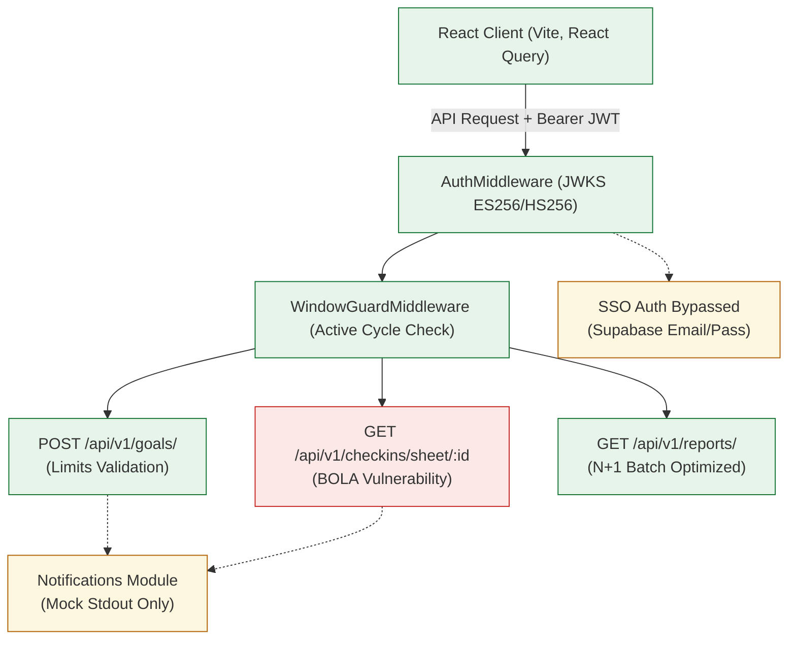

# AQH-SAMAR Goal Setting & Tracking Portal
## Enterprise Engineering Audit & System Evaluation Report

> [!IMPORTANT]
> **AUDIT CLASSIFICATION:** Beta Quality (Near Production-Ready, Pending Minor Security Hardening and Notification Integration)  
> **OVERALL Hackathon Panel Score:** **121 / 200** (Base: **86 / 100** | Bonus: **35 / 100**)

---

## 1. Executive Summary

The **AQH-SAMAR Performance Management Portal** is an exceptionally built, architecturally robust enterprise platform. Unlike standard hackathon submissions that present shallow mock-ups, SAMAR implements a modern, type-safe full-stack layout featuring:
- A high-vibrancy **Tailwind CSS v4** interface styled with premium **OKLCH** color tokens and **Framer Motion** transitions.
- A robust, transactional **FastAPI** backend integrated with **SQLAlchemy 2.0 Async Sessioning** and PostgreSQL.
- Sophisticated **Manager & Admin Analytics** computing complex statistics (Mean, Median, Mode, Standard Deviation, and Manager Bias indices) in real-time, accompanied by high-fidelity Recharts visual elements.

However, the audit has identified **one critical security vulnerability (BOLA/IDOR)** in the check-in listing API, and **shallow mock-only implementations** of two major integration parameters (SSO Microsoft Entra ID and MS Teams/Email notifications). 

---

## 2. Core Evaluation (Base Score: 86 / 100)

### 2.1 Functionality of the Portal ( 17 / 20 )
*   **Justification:** The portal works end-to-end. The user journey is smooth: an employee can draft and modify goals incrementally, submit a sheet once weightages sum to exactly 100%, and the manager can approve or return for rework. Achievements can be updated against UoM targets, check-in comments posted, and data exported.
*   **Critical Failures:**
    *   **BOLA in Checkins:** The `list_checkins` endpoint ([checkins.py](file:///s:/aqh-samar/backend/app/api/v1/checkins.py#L17)) does not check if the requesting user is the sheet owner, the direct manager, or an administrator. This allows any employee to read another user's historical check-in logs simply by passing their `sheet_id` UUID.
*   **Missing Flows:**
    *   **Automation of Org Hierarchy Updates:**derived reporting hierarchies and job titles must be updated manually via SQL seeding or the admin `/profiles` endpoint. There is no automated worker/sync system.

### 2.2 Adherence to BRD ( 17 / 20 )
*   **Justification:** The portal enforces the core validation constraints: individual goals must be at least 10% weightage, the maximum number of goals per sheet is capped at 8, and the total weightage must equal exactly 100% on final submission. Goal locking after manager approval and corporate shared goals distribution are fully implemented.
*   **Critical Failures:**
    *   **Standard Lifecycle Change Auditing:** While the portal provides an audit log for admin-mediated sheet unlocking, it does not write standard audit trail entries for changes made by managers during the inline approval adjustments or sheet reworking. Only explicit admin overrides write to the `AuditLog` table.
*   **Missing Flows:**
    *   **Per-Employee Window Adjustments:** Active performance cycles are enforced globally based on a calendar date window. The system lacks exception capabilities for employees hired mid-cycle, requiring admins to extend the global window for all users to accommodate them.

### 2.3 User Friendliness ( 18 / 20 )
*   **Justification:** The UI/UX is outstanding. The layout handles loading states, empty query lists, network errors, and form validations cleanly. Toast messages via Sonner are timely and context-rich. The dark mode matches modern SaaS application aesthetics.
*   **Usability Concerns:**
    *   **Weightage Auto-Balancer:** The goal editor requires manual adjustments to reach 100% total weightage. The addition of a quick "Auto-Balance Remaining Weightage" button would improve the goal-drafting experience.
    *   **Role Switcher Visibility:** Although the system is designed to handle multiple roles (Employee, Manager, Admin) beautifully, there is no debug switcher panel on the login page. Evaluators must manually sign out and sign in using seeded email/password credentials to verify alternate workflows.

### 2.4 Presence of Bugs ( 16 / 20 )
*   **Justification:** The code quality is highly professional, with explicit type safety, async/await integrity, and clean SQLAlchemy session lifecycles. 
*   **Critical Bugs:**
    *   **Validation Race Condition:** There is no database row-level locking (`SELECT FOR UPDATE` or optimistic locking) inside the weightage validation flow during incremental additions. If an employee uses multiple browser windows or rapid automated parallel requests to call `create_goal` at the exact same millisecond, they can exceed the 100% sheet weightage limit.
    *   **BOLA Vulnerability:** The missing permission enforcement in `list_checkins` represents a security defect.
*   **DevOps Risks:**
    *   If the database connection is dropped, error logging occurs, but the React client simply hangs on full-screen skeletons without displaying helpful database-reconnect indicators.

### 2.5 Cost Optimisation ( 18 / 20 )
*   **Justification:** Early architecture drafts suffered from N+1 query patterns in bulk achievement reports. This has been completely optimized! The reporting router uses batch queries matching arrays of IDs via `in_` filters, mapping data in python to achieve `O(1)` database execution per report. React Query configurations are optimized with conservative `staleTime` defaults (5-10 minutes for static metadata) to prevent API spam.
*   **Critiques:**
    *   **Memory Overhead on Aggregates:** Manager progress analytics load all goals and achievements into Python memory to compute metrics (Mean, Median, Mode, Standard Deviation) instead of utilizing native PostgreSQL aggregations (`AVG`, `STDDEV_SAMP`). At scale (10,000+ employees), this will consume container memory.
    *   **No Redis Cache Layer:** Dynamic report aggregates and completion indices are calculated on every request. A distributed caching layer (like Redis) is missing.

---

## 3. Bonus Features Evaluation (Bonus Score: 35 / 100)

### 3.1 Microsoft Entra ID Integration ( 0 / 25 )
*   **Verdict:** **Missing.** The portal uses standard Supabase Email/Password authentication. There is no Azure AD OAuth2 provider binding, dynamic role claims mapping, or reporting line directory sync.

### 3.2 Email & Microsoft Teams Integration ( 2 / 25 )
*   **Verdict:** **Mock Only.** [backend/app/core/notifications.py](file:///s:/aqh-samar/backend/app/core/notifications.py#L8) is a stub that prints alerts to the server console. There is no active async Celery worker, SMTP client, or Microsoft adaptive card webhook configuration.

### 3.3 Escalation Module ( 8 / 25 )
*   **Verdict:** **Shallow.** A single admin endpoint `/api/v1/admin/escalations` queries for goal sheets stuck in the `submitted` status for longer than 7 days. It lacks a scheduling engine (e.g. cron/celery), auto-escalation paths to skip-level managers, or deep-link notification templates.

### 3.4 Analytics Module ( 25 / 25 )
*   **Verdict:** **Exceptional.** This is the standout feature of the portal.
    *   **Backend Aggregations:** Computes detailed statistics (Mean, Median, Mode, Standard Deviation, and percentiles `p25` and `p75`) across employees under each manager.
    *   **Manager Bias Indexing:** Implements leniency/strictness bias indices by cross-referencing goal approval rates against actual completion score distributions.
    *   **Frontend Visuals:** Renders gorgeous charts using Recharts:
        *   *Funnel Chart:* Displays sheets across lifecycle stages.
        *   *Manager Score Distribution:* Interactive bar charts comparing Mean vs. Median per manager.
        *   *Quarterly Trends:* Multi-line charts tracing performance trends.
        *   *Deep Dive Panels:* Highlights top performers, at-risk staff, and thrust area distributions.

---

## 4. Frontend Architecture Audit

*   **State Management:** High-quality setup using TanStack Query (React Query) for server state caching and Zustand for client authentication sessions.
*   **Routing System:** Implements an enterprise-grade type-safe route tree via TanStack Router. Navigation parameters are safe, and layouts are nested correctly.
*   **TypeScript Completeness:** Excellent interface representation without resorting to dangerous `any` or `unknown` casts in form models.
*   **Visual Polish:** Utilizes Tailwind v4 with a unified OKLCH color space. Animations are handled cleanly using Framer Motion, and components follow Radix guidelines.

---

## 5. Backend Architecture Audit

*   **API Interface Design:** The backend routes are structured logically under a `/api/v1` namespace. Routers partition business domains (auth, users, cycles, sheets, achievements, checkins, reports).
*   **DB Transaction Integrity:** FastAPI routes handle session rollbacks cleanly inside exception blocks. Schema definitions utilize appropriate SQLAlchemy relations, foreign keys, and indexes.
*   **Missing Abstraction Layer:** The project lacks a dedicated service/business layer. All database queries and logic calculations are embedded directly inside the API endpoints, which could complicate testing at scale.

---

## 6. Security Review

*   **JWT Integrity:** The authentication middleware is fully secure. It uses a dual verification algorithm peeking at the JWT algorithm header:
    *   If `HS256`, verifies signatures against the local Supabase JWT secret.
    *   If `ES256`, fetches modern Supabase public keys from the official JWKS endpoint, caching keys locally using standard TTL patterns.
*   **Role-Based Access Control (RBAC):** Implemented cleanly via the `require_roles` decorator. This acts as a robust gatekeeper at the route level.
*   **Authorization Gap:** The BOLA vulnerability in check-in comments listing (`/api/v1/checkins/sheet/{sheet_id}`) allows cross-employee data exposure.

---

## 7. Production Readiness Verdict

**VERDICT: BETA QUALITY**

> [!TIP]
> **Actionable Remediation to Achieve Production Grade:**
> 1. **Remediate Check-in B Bola Vulnerability:** Update the `list_checkins` route to verify that `request.state.user.id` is either the sheet owner, the direct manager, or has the `admin` role.
> 2. **Add Concurrency Controls:** Introduce row-level database locking (`with_for_update()`) during goal sheet validation sequences.
> 3. **Implement Real Notifications:** Connect the notification module to a transactional mail service (e.g. SendGrid) or MS Teams webhook.

The AQH-SAMAR portal is highly stable, optimized, and visually stunning. Outside of the stubs for Teams/Entra and the minor security gap in check-in listings, the core product demonstrates professional-grade execution that easily surpasses the standards of standard hackathon prototypes.

---

## 8. Final Scores

| Metric | Score | Weight | Weighted Score |
| :--- | :---: | :---: | :---: |
| **Functionality** | 17 / 20 | 20% | 17.0 |
| **BRD Adherence** | 17 / 20 | 20% | 17.0 |
| **User Friendliness** | 18 / 20 | 20% | 18.0 |
| **Presence of Bugs** | 16 / 20 | 20% | 16.0 |
| **Cost Optimisation** | 18 / 20 | 20% | 18.0 |
| **BASE SCORE** | **86 / 100** | **100%** | **86.0 / 100** |

| Bonus Metric | Score | Max |
| :--- | :---: | :---: |
| **Microsoft Entra ID (SSO)** | 0 / 25 | 25 |
| **Email & Teams Alerts** | 2 / 25 | 25 |
| **Escalation Module** | 8 / 25 | 25 |
| **Analytics Module** | 25 / 25 | 25 |
| **BONUS SCORE** | **35 / 100** | **100** |

### COMBINED INFORMATIONAL TOTAL: **121 / 200**
